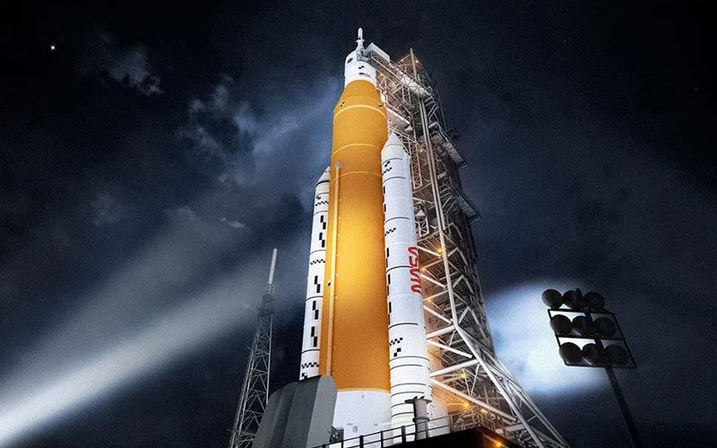

# Artemis 1 - El despegue

Vamos a modelar (en una versión muuuuuy básica) este histórico momento que es el despegue de la nave Artemis 1, que tiene como misión principal, después de 50 años, enviar un vehículo construido por el hombre a nuestro satélite natural: La Luna.

Nuestro objetivo es conseguir un diseño que nos permita que la computadora que gobierna al vehículo nos de el Ok para el despegue, por lo tanto, a **artemis1** deberemos poder enviarle el mensaje **puedeDespegar**, y será verdadero cuando todos sus componentes respondan verdero a la consulta **estaOK** 

Luego, en próximos ejercicios, modelaremos lo que ocurre cuando obtengamos una respuesta positiva, ya que esperamos que se inicie la cuenta regresiva para el despegue, pero por ahora vamos por el principio.

## Sobre Artemis 1
La nave deberá ser ensamblada con distintos componentes que pasamos a detallar a continuación:

-	2 **cohetesSolidos** que artemis1 deberá conocer y que modelaremos en una lista. Entre los 2 tienen un empuje total de 39000 kN, pero esto no es relevante por ahora para este modelo inicial. El sistema de cohetesSolidos **estaOK** cuando ambos cohetes están OK. Debemos construir un método para **armarcohetesPrimeraFase** pasándole como argumento los 2 cohetes que estarán Ok cuando ambos estén en ignición; considerar un método para **darleIgnicion** y estos serán:
    *	**coheteSolidoIzquierdo**.
    *	**coheteSolidoDerecho**.

.
-	Un espacio para una **capsula** que inicialmente no está montada o podemos considerar que existe un objeto llamado **huecoCapsula**, pero debemos poder indicarle a la computadora de artemis1 el mensaje **montarCapsula**; y en esta misión, se utilizará la capsula **orion** que tiene las siguientes características:
    * Espacio para 1 paracaídas, que inicialmente no está montado, pero debemos poder indicarle **montarParacaidas**, y eso provocará que orion tenga montado el paracaídas.
    * Debemos poder **fijarEscudoDeCalor**, lo que provoca que orion tenga el **escudoDeCalorListo** solo luego de llamar a ese método.
    * Y **cargarBateriasModulo**. Esto consigue que se carguen al 100% las baterías y orion nos responda que las **bateriasModuloDeServicioOK**
    * orion **estaOK** cuando está montado el paracaídas, tiene listo el escudo de calor y las baterías del módulo de Servicio están OK.

.
-	**propulsionPrincipal**:  Un **propulsorPrincipal**  (este es de combustible líquido). Decimos que **estaOK** cuando todos sus atributos también lo están, que son los siguientes:
    * **nivelDeCombustibleOk**. Comienza con nivel de combustible en falso, pero tendremos un método para **cargarCombustible** que fijará el nivel de combustible en true.
    * 4 motores que ya vienen montados en este propulsor (son parte de él), y los modelaremos en una lista. De ellos debemos saber si **estaRefrigerado** cada uno de ellos o no. En principio no están refrigerados, pero debemos tener un método que nos permita **refrigerarMotores** y esto ocasionará que todos se refrigeren a la vez, gracias a la topología de la construcción de este impresionante propulsor. Ya conocemos los objetos que representan a cada motor y deberán indicarse con los siguientes nombres:
        1)	**motorPrincipal1**
        2)	**motorPrincipal2**
        3)	**motorPrincipal3**
        4)	**motorPrincipal4**

